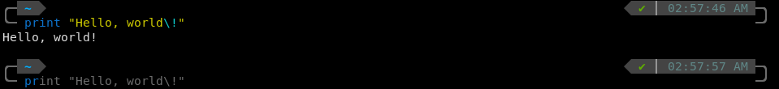
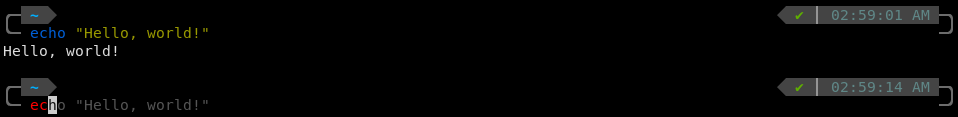

# dotfiles
my dotfiles, managed using `yadm`.  

#### contents
1. `zsh` setup, using `zim`  
2. `fish` setup (warning: probably unmaintained excluding serious issues as i have switched to zsh)  
misc other configs:
3. `bash` setup, with `oh-my-bash`

#### screenshots
ZSH:

Fish:

#### requirements
requirements for all:
`zoxide`
`pnpm` (optional if you remove the aliases)

zsh requirements:
- `zsh` (obviously)
- `zim` (*install this before the dotfiles so the defaults can be overwritten*)

fish requirements:
- `fish` (obviously)
- `fisher` (https://github.com/jorgebucaran/fisher)

#### installation
all:
1. download and install yadm (other dotfile managers may work, but are not supported)
2. clone this repo with yadm, and resolve conflicts  
	`yadm clone https://github.com/Ruthenic/dotfiles`  

zsh:  
3. run `zimfw install`.  

fish:  
TODO  

you are done.
